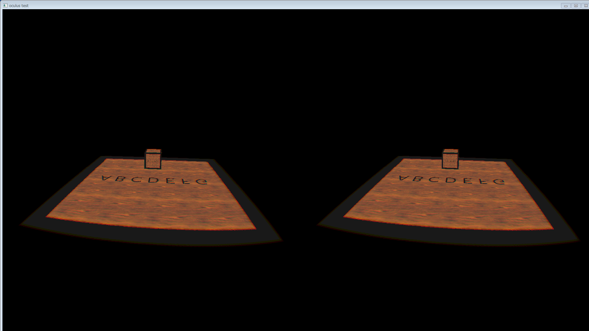

Haskell bindings to Oculus SDK 0.5.0.1 (OS X & Windows)
====

Overview
 Low-level Haskell bindings to Oculus SDK.

## Description
 (T.B.D....)

## Requirements

* [Oculus SDK and runtime](https://developer.oculus.com/)

## Install

1. install Oculus SDK(0.5.0.1) and Runtime.
1. `git clone https://github.com/lukexi/bindings-Oculus.git`
1. `cabal sandbox init`
1. `cabal install --dependencies-only`
1. `cabal build`
1. run sample program.
  1. set Display Mode to "Extend Desktop to the HMD"
  1. run sample program. `cabal run sample1`
  1. (Windows only) set Display Mode to "Direct HMD Access form Apps"
  1. run sample program. `cabal run sample2`

## Licence

[Apache License, Version 2.0](http://www.apache.org/licenses/LICENSE-2.0)

## Author

[mishima](https://twitter.com/tty_mishima)
[lukexi](https://twitter.com/lukexi)
